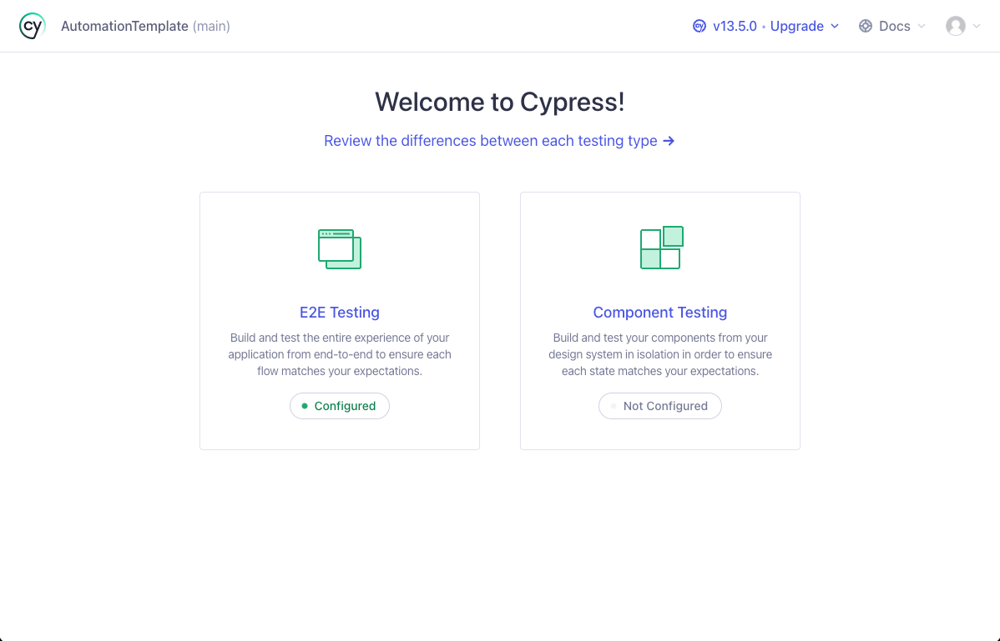
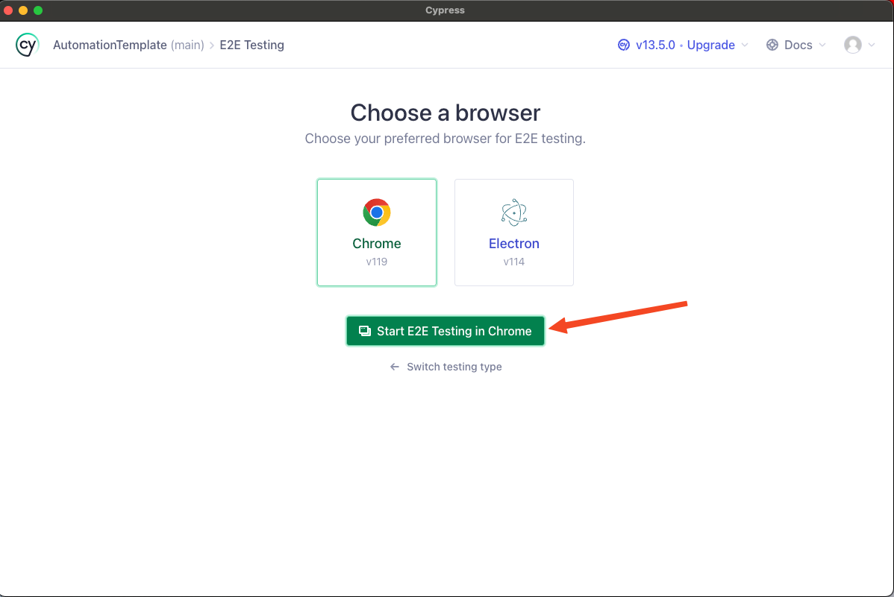
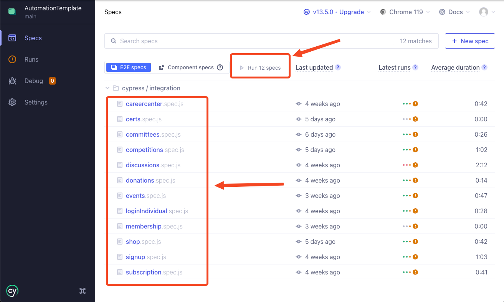

# AutomationTemplate
## Requirements
 - Node v20 or above - https://nodejs.org/en/download
 - Cypress v13 or above - https://docs.cypress.io/guides/getting-started/installing-cypress


## First Steps
### Clone Repository
```
git clone https://github.com/membersuite-private/AutomationTemplate.git
```
### Install dependencies
```
npm install  --legacy-peer-deps
```


### Define which environment do you want to run the tests

On file `cypress.config.js` you can define what environment the tests are going to run.
To do that you need uncomment the `baseUrl` you are going to use
```
//baseUrl: "https://mrpbpag.users.green.membersuite.com",
//baseUrl:"https://mrpbpap.users.purple.membersuite.com",
//baseUrl:"https://mrpbpap.users.membersuite.com",
```

## How to run tests
### Run with Graphical Interface
 
 ```
npx cypress open
```
Choose E2E Testing


Choose what browser do you want to use to run the tests than click in `Start E2E Testing in <browser>`


Choose which test plan do you want to run clicking on a specific module.spec.js or run all tests clicking `Run 12 specs`


### Run with Command Line
 ```
npx cypress run --env grep="[PURPLE]"
npx cypress run --env grep="[GREEN]"
npx cypress run --env grep="[PRODUCTION]"
```
