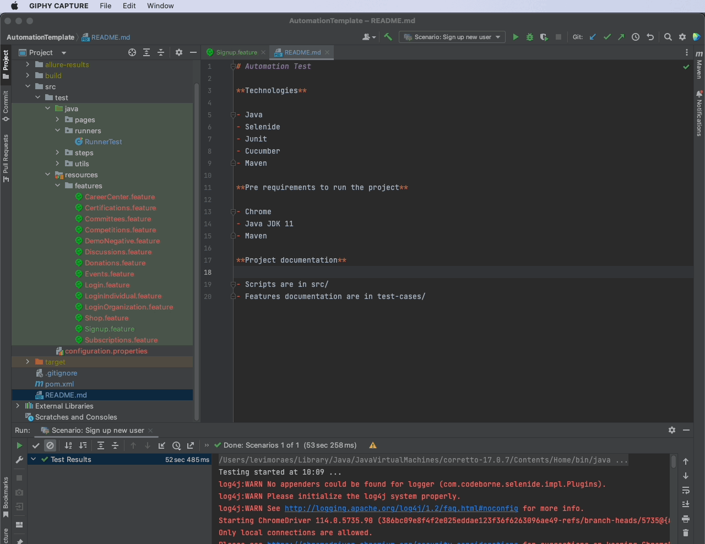
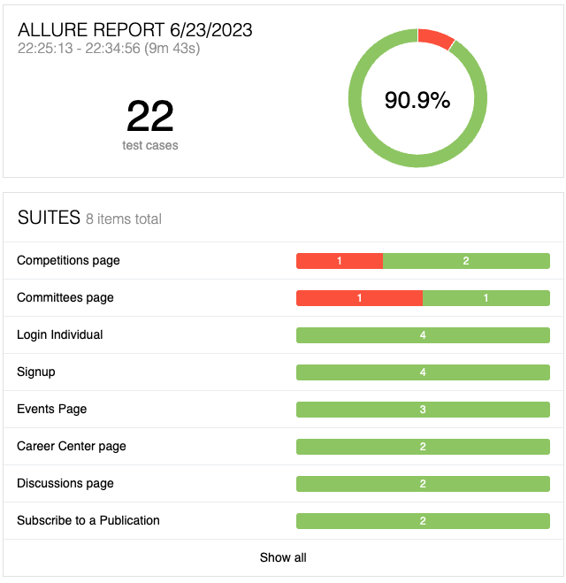

# AutomationTemplate
## Requirements
 - Java JDK 17 or above
 - Cucumber Plugin

## First Steps
### Install Cucumber Plugin
- Go to IntelliJ settings 
- Open Plugins menu
- Search for "Cucumber" and install the "Cucumber fo Java"

## REPORT
